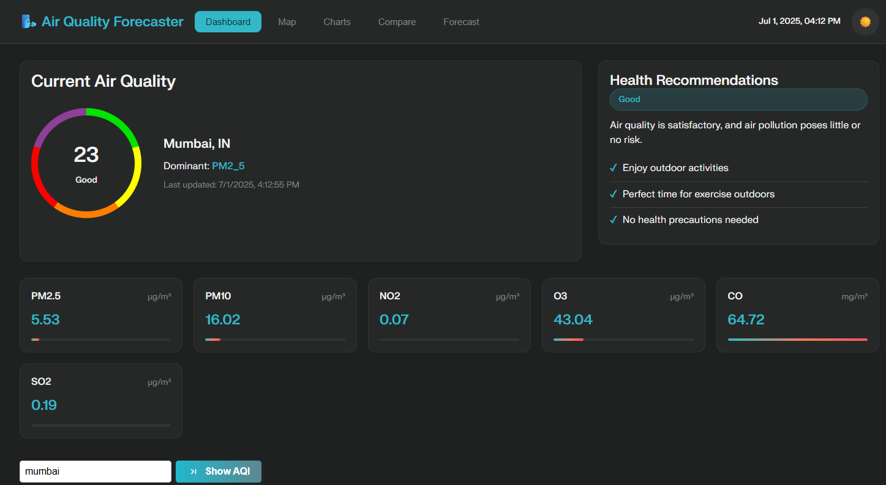
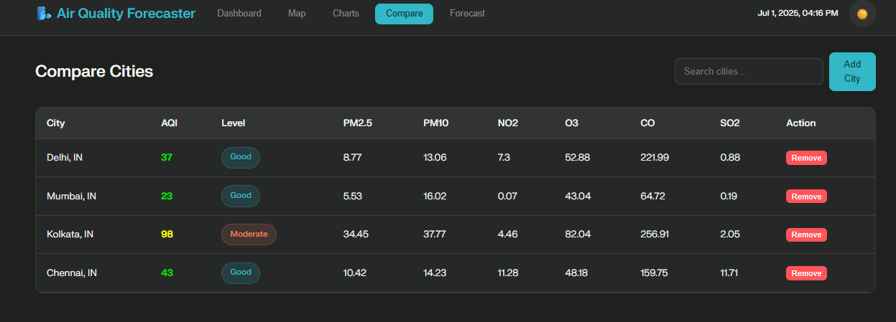

🌬️ Air Quality Forecaster
🚧 Prototype Notice:
This is a prototype developed as part of the Bharatiya Antariksh Hackathon 2025 (Problem Statement 7). It will evolve into a full-scale web and mobile application with extended data sources including CPCB, IMD, and ISRO APIs.

A modern, interactive web application for visualizing, comparing, and forecasting air quality (AQI) and pollutant levels for major cities and underserved rural regions in India. Built with real-time data, beautiful charts, and a clean UI.

## 🖼️ App Screenshots

### Dashboard

### Charts

### Compare Cities

### ML Forecast

---
🚀 Features (Currently Implemented)
📊 Live AQI Dashboard:

Real-time AQI using demo/sample data or OpenWeatherMap

Pollution breakdown and zone visualization

🗺️ Global/Local Map:

Interactive map with AQI overlays

📈 Trends & Analytics:

Time-series charts for pollutants (PM2.5, NO₂)

Historical trend visualization

⚖️ Compare Locations:

Compare AQI and pollutants for multiple cities

🔮 Forecast (Basic Model):

5-day AQI prediction using basic/random/statistical model

💾 Data Persistence:

User-selected cities and preferences stored locally

📱 Responsive UI:

Mobile-friendly web design

🛠️ Planned Features (Upcoming)
🛰️ Satellite-based pollution mapping (via ISRO Bhuvan)

📡 Real-time AQI from CPCB and IMD APIs

🤖 ML-based 24–72 hour AQI forecasting

🧠 Health advisory system with alerts

🌾 Pollution source detection (traffic, industrial, crop burning)

📲 Flutter/React-based mobile app

🌐 API Integration
Currently Used:
OpenWeatherMap Air Pollution API

Upcoming:
Ground Monitoring: CPCB, AQICN, OpenAQ

Satellite Intelligence: ISRO Bhuvan

Weather Data: IMD

Mapping: Google Maps, Bhuvan Maps

🌳 Project Structure (Branch-wise)
main — Production-ready app, stable features.

dev — Latest development, experimental features.

ml-forecast — ML/statistical AQI forecasting integration and scripts.

data-scripts — Data generation and charting scripts (Python).

docs — Documentation and guides.

⚡ Getting Started
Install Python dependencies (for data/scripts):

pip install pandas statsmodels plotly
Start the app:

Open index.html in your browser.

Use offline dataset or insert real API key in app.js.

🔮 Forecasting
Uses a placeholder model (random/statistical) for 5-day AQI prediction.

ML integration in progress in the ml-forecast branch.

✨ Credits & Acknowledgements
Data: OpenWeatherMap (current), CPCB/ISRO/IMD (planned)

Charts: Chart.js, Plotly

Maps: Leaflet.js

UI: Custom CSS + Tailwind/Material UI

📣 License
MIT License. Free to use, modify, and share.

Made with ❤️ for clean air and data-driven insights, especially for rural India.

